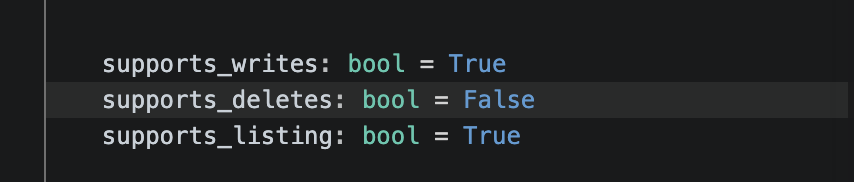
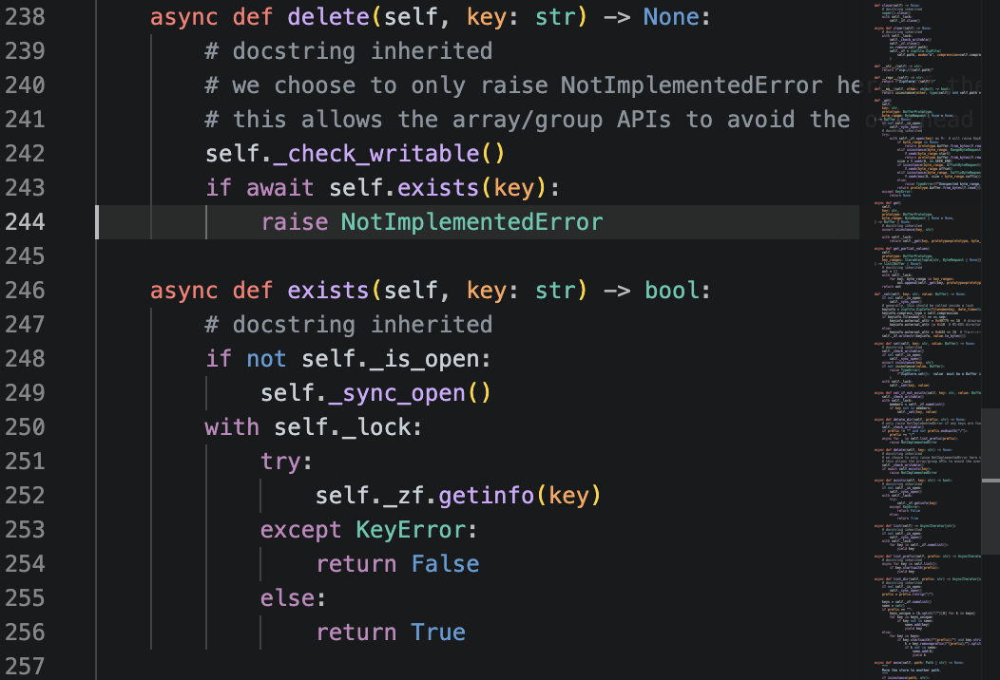

# Contribution #1: Implementing ZipStore's `__delitem__` via Overwrite in zarr-python

---

| Field | Details |
|---|---|
| **Contribution #** | 1 |
| **Student** | Akash Tiloda |
| **Project** | [zarr-developers/zarr-python](https://github.com/zarr-developers/zarr-python) |
| **My Fork** | [Akash-t25/zarr-python](https://github.com/Akash-t25/zarr-python) |
| **Issue** | [#828 — Implementing ZipStore's \_\_delitem\_\_ via overwrite](https://github.com/zarr-developers/zarr-python/issues/828) |
| **Status** | Phase I — In Progress |

---

## Why I Chose This Issue

My original issue for this contribution was PyLabRobot issue #719 — adding a `preferred_pickup_distance_from_top` attribute to the `Resource` base class. I completed Phase 1 and Phase 2 with that issue, but during Phase 2 I discovered it had been closed by the maintainer: the problem was addressed in PR #872 before I had a chance to contribute. That was a real lesson in open source timing — issues can close between when you claim them and when you're ready to write code. Rather than treating it as a setback, I used it as signal to look more carefully at issue age and PR history before committing to a new one.

For my replacement issue, I landed on zarr-python issue #828. Zarr is a Python library for storing chunked, compressed N-dimensional arrays — the kind of data infrastructure that shows up in climate science, genomics, and ML data pipelines, used by organizations like NASA and the Pangeo project. The issue is a well-scoped enhancement: `ZipStore.__delitem__` currently raises `NotImplementedError` because ZIP files don't natively support deleting members. The proposed fix is a soft-delete — overwrite the entry with empty bytes and update the surrounding methods to treat it as absent. Two previous PRs (#1184 and #2838) attempted this but went stale. That history tells me the problem is real and the maintainers want it solved, but it needs someone to pick it up and carry it through.

---

## Understanding the Issue

### Problem Description

Zarr arrays can be backed by different storage backends. One of them is `ZipStore`, which stores array chunks inside a ZIP archive. ZIP files do not natively support deleting individual members, so `ZipStore.__delitem__` raises `NotImplementedError`. This makes `ZipStore` a second-class backend — any Zarr operation that needs to delete a chunk (e.g., resizing an array) will fail at runtime when backed by a ZIP store.

### Expected Behavior

`ZipStore.__delitem__` should succeed without raising `NotImplementedError`. The proposed approach is a soft-delete: overwrite the target entry with an empty byte string `b""` to mark it as deleted. The surrounding methods — `__contains__`, `__getitem__`, and `keys()` / `keylist()` — should be updated to treat entries with empty bytes as absent, so callers see a consistent view with no trace of the deleted key.

### Current Behavior

- `ZipStore.__delitem__` raises `NotImplementedError`.
- Any Zarr operation requiring chunk deletion fails when using a ZIP-backed store.
- `__contains__`, `__getitem__`, and `keylist()` have no awareness of soft-deleted entries.

### Affected Components

| Component | Role |
|---|---|
| `zarr/storage.py` — `ZipStore.__delitem__` | Currently raises `NotImplementedError`; needs soft-delete logic |
| `zarr/storage.py` — `ZipStore.__contains__` | Needs to return `False` for empty-byte entries |
| `zarr/storage.py` — `ZipStore.__getitem__` | Needs to raise `KeyError` for empty-byte entries |
| `zarr/storage.py` — `ZipStore.keylist()` | Needs to exclude empty-byte entries from the returned list |
| `zarr/tests/test_storage.py` | Needs new tests covering the soft-delete behavior |

---

## Reproduction Process

### Environment Setup

> To be completed in Phase II — will document Python version, virtual environment setup, and installation steps after local environment is confirmed working.

### Steps to Reproduce

> To be completed in Phase II — will include step-by-step instructions for reproducing the `NotImplementedError` from `ZipStore.__delitem__`.

### Reproduction Evidence

> To be completed in Phase II — will include a code trace or screenshot confirming the error is raised in the current codebase.




---

## Solution Approach

### Analysis

> To be completed in Phase II — will include a full trace of the `ZipStore` class, a review of what PRs #1184 and #2838 attempted, and a precise mapping of all lines that need to change.

### Proposed Solution (High Level)

The fix implements a soft-delete pattern across four methods in `ZipStore`:

1. **`__delitem__`** — instead of raising `NotImplementedError`, overwrite the ZIP entry with `b""`:
   ```python
   def __delitem__(self, key):
       with self._mutex:
           if key not in self:
               raise KeyError(key)
           self.zf.writestr(key, b"")
   ```

2. **`__contains__`** — exclude entries whose value is `b""`:
   ```python
   def __contains__(self, key):
       return key in self.zf.namelist() and self.zf.read(key) != b""
   ```

3. **`__getitem__`** — raise `KeyError` for soft-deleted entries:
   ```python
   def __getitem__(self, key):
       value = self.zf.read(key)
       if value == b"":
           raise KeyError(key)
       return value
   ```

4. **`keylist()` / `keys()`** — filter out empty-byte entries so they are invisible to callers.

The two stale PRs (#1184 and #2838) will be reviewed before writing any code to understand what feedback the maintainers gave and why those PRs didn't land.

### Implementation Plan (UMPIRE Framework)

| Phase | Step | Description |
|---|---|---|
| **U — Understand** | Read the issue and stale PRs | Review #1184 and #2838 to understand prior attempts and maintainer feedback |
| **M — Match** | Identify the pattern | Confirm the soft-delete approach aligns with how other `MutableMapping` stores handle this |
| **P — Plan** | Map the change set | List every line in `storage.py` and `test_storage.py` that needs to change |
| **I — Implement** | Write the code | Update the four methods and add tests |
| **R — Review** | Self-review and test | Run the full test suite; confirm no regressions in other store backends |
| **E — Evaluate** | Open the PR | Submit, reference issue #828 and prior PRs, respond to maintainer feedback |

---

## Testing Strategy

### Unit Tests

- `test_zipstore_delitem_removes_key` — verify that after `del store[key]`, `key not in store` is `True`.
- `test_zipstore_delitem_raises_keyerror_for_missing_key` — verify that deleting a non-existent key raises `KeyError`.
- `test_zipstore_getitem_raises_keyerror_after_delete` — verify that accessing a soft-deleted key raises `KeyError`.
- `test_zipstore_contains_false_after_delete` — verify that `key in store` returns `False` after deletion.
- `test_zipstore_keys_excludes_deleted` — verify that soft-deleted keys do not appear in `store.keys()`.

### Integration Tests

- `test_zipstore_array_resize_after_delete` — verify that a Zarr array backed by `ZipStore` can resize (which internally deletes chunks) without error.

### Manual Testing

> To be completed in Phase III — will run the existing test suite after implementing the change to confirm no regressions before submitting the PR.

---

## Implementation Notes

### Week 1 Progress

- [x] Identified and researched the issue
- [x] Read zarr documentation and understood the `ZipStore` backend
- [x] Reviewed prior PRs #1184 and #2838 for context
- [x] Confirmed the issue is open and unclaimed
- [ ] Set up local development environment (Phase II)
- [ ] Reproduced the `NotImplementedError` locally (Phase II)
- [ ] Confirmed scope with maintainer via issue comment (Phase II)

### Code Changes

> None yet — implementation begins in Phase III after environment setup and reproduction are complete in Phase II.

### Pull Request

> To be opened in Phase IV after implementation and testing are complete.

---

## Learnings & Reflections

> To be completed as the contribution progresses.

---

## Resources Used

- [zarr-python GitHub Repository](https://github.com/zarr-developers/zarr-python)
- [My zarr-python Fork](https://github.com/Akash-t25/zarr-python)
- [Issue #828 — Implementing ZipStore's \_\_delitem\_\_ via overwrite](https://github.com/zarr-developers/zarr-python/issues/828)
- [Prior PR #1184](https://github.com/zarr-developers/zarr-python/pull/1184)
- [Prior PR #2838](https://github.com/zarr-developers/zarr-python/pull/2838)
- [zarr documentation](https://zarr.readthedocs.io)
- CodePath AI301 course materials
