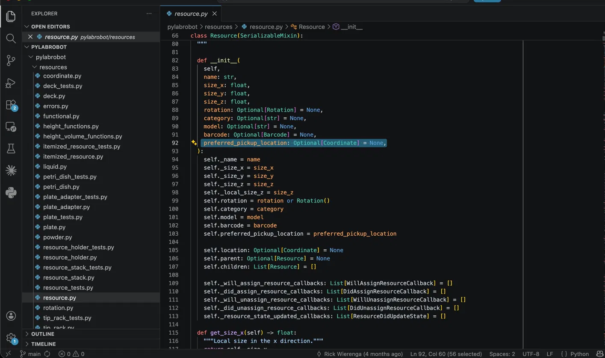

# Contribution #1: Add `preferred_pickup_distance_from_top` Attribute to PyLabRobot Resource Class

---

| Field | Details |
|---|---|
| **Contribution #** | 1 |
| **Student** | Akash Tiloda |
| **Project** | [PyLabRobot/pylabrobot](https://github.com/PyLabRobot/pylabrobot) |
| **My Fork** | [Akash-t25/pylabrobot](https://github.com/Akash-t25/pylabrobot) |
| **Issue** | [#719 — resources should have a preferred_pickup_distance_from_top attribute](https://github.com/PyLabRobot/pylabrobot/issues/719) |
| **Status** | Phase II — Complete |

---

## Why I Chose This Issue

When I came across PyLabRobot, the topic immediately stood out. An open-source SDK that translates Python code into precise robotic arm movements used in real research labs — the application and potential here are hard to ignore. The maintainers are also exploring LLM integration into the robotics planning layer, which adds another dimension to what this codebase could become.

Issue #719 caught my attention because it's a small, well-scoped change with real downstream impact. Adding a per-resource grip height preference sounds simple, but it requires understanding how the `Resource` class hierarchy works, how attributes flow through serialization, and how the movement planner consumes metadata at runtime. As a Teaching Fellow for AI301, I also want to experience the same friction my students will face — the unfamiliar codebase, the moment where a five-line change turns into tracing inheritance across multiple files. This issue is exactly that kind of problem.

---

## Understanding the Issue

### Problem Description

PyLabRobot is a hardware-agnostic Python SDK for controlling lab automation robots — Hamilton STAR, Tecan EVO, Opentrons OT-2, and others. When a robotic arm picks up a resource (a microplate, a tip rack, a reservoir), it needs a vertical offset: how far from the top of the resource should the gripper descend before closing?

Currently, that value defaults to `0` everywhere. There is no per-resource preferred grip height. Every plate and every tip rack is treated identically, even though their physical geometries differ significantly. A 96-well plate and a 384-well plate do not have the same ideal grip point.

### Expected Behavior

After the fix, each `Resource` subclass should be able to declare its own `preferred_pickup_distance_from_top` — an optional float representing the ideal grip offset in millimeters from the top of the resource. When a movement is planned and no explicit offset is passed by the caller, the robot should fall back to this preferred value instead of always defaulting to `0`.

From the maintainer's description, the goal is to "facilitate smart defaults on a resource by resource basis for robotic arm movements."

### Current Behavior

- `Resource.__init__` does not accept or store a `preferred_pickup_distance_from_top` parameter.
- Existing resource definitions (plates, tip racks, reservoirs) have no grip-height metadata.
- The movement planner has no mechanism to consult a per-resource preferred offset; it always uses `0` or whatever the caller explicitly provides.

### Affected Components

| Component | Role |
|---|---|
| `pylabrobot/resources/resource.py` | Base `Resource` class — needs the new attribute |
| Individual resource definition files (plates, tip racks, etc.) | Need to be updated with preferred values |
| Robot arm movement planner | Needs to consult `preferred_pickup_distance_from_top` as a fallback default |
| Serialization / deserialization (`to_dict` / `from_dict`) | Attribute must round-trip through JSON correctly |

---

## Reproduction Process

### Environment Setup

```bash
git clone https://github.com/Akash-t25/pylabrobot.git
cd pylabrobot
python3 -m venv env
source env/bin/activate
pip install -e ".[dev]"
```

Installation completed successfully: `Successfully installed PyLabRobot-0.2.1`.

### Steps to Reproduce

1. Activate the virtual environment and open `pylabrobot/resources/resource.py`.
2. Inspect `Resource.__init__` — the parameter list is: `name`, `size_x`, `size_y`, `size_z`, `rotation`, `category`, `model`, `barcode`, `preferred_pickup_location`. No `preferred_pickup_distance_from_top`.
3. Run a repo-wide search for `preferred_pickup_distance_from_top` — zero hits anywhere in the codebase.
4. The attribute named in issue #719 does not exist. Issue confirmed reproduced.

### Reproduction Evidence

A repo-wide search (`grep -r "preferred_pickup_distance_from_top" .`) returns no results, confirming the attribute is entirely absent from the codebase.



**Key discovery during analysis:** The maintainer has already added a related but different attribute — `preferred_pickup_location`, a full `Coordinate(x, y, z)` object. In `pylabrobot/liquid_handling/liquid_handler.py` (lines 2028–2038), the movement planner already derives `pickup_distance_from_top` from `preferred_pickup_location.z` when no explicit offset is provided. This means the "smart default" mechanism the issue describes is partially solved through a different approach. I left a comment on issue #719 asking the maintainer whether a separate `preferred_pickup_distance_from_top: float` is still needed given `preferred_pickup_location` already exists — awaiting response before writing any code.

---

## Solution Approach

### Analysis

`Resource` inherits from `SerializableMixin`, which means serialization goes through `serialize()` and `deserialize()` — not `to_dict`/`from_dict` as I initially assumed in Phase I. Existing optional attributes follow this pattern in `serialize()`:

```python
"preferred_pickup_location": serialize(self.preferred_pickup_location)
```

One important downstream consequence: approximately six test files hardcode the complete expected serialization dictionary. Adding any new key to `serialize()` will break all of them simultaneously. This is the largest mechanical cost of the change.

**Files that need to be modified:**

| File | Change required |
|---|---|
| `pylabrobot/resources/resource.py` | Add param to `__init__`, docstring, `serialize()`, `deserialize()` |
| `pylabrobot/liquid_handling/liquid_handler.py` (lines 2028–2038) | Update smart-default fallback chain |
| `pylabrobot/resources/resource_tests.py` | Serialization tests assert exact dict shape |
| `pylabrobot/resources/well_tests.py` | Same reason |
| `pylabrobot/resources/carrier_tests.py` | Same reason |
| `pylabrobot/resources/container_tests.py` | Same reason |
| `pylabrobot/resources/plate_adapter_tests.py` | Same reason |
| `pylabrobot/resources/petri_dish_tests.py` | Same reason |

**Pending:** Awaiting maintainer response on issue #719 before finalizing whether `preferred_pickup_distance_from_top` (float) is needed alongside the existing `preferred_pickup_location` (Coordinate), or whether the solution should take a different shape entirely.

### Proposed Solution (High Level)

1. **Add the attribute to the base class.** In `Resource.__init__`, add an `Optional[float]` parameter:
   ```python
   preferred_pickup_distance_from_top: Optional[float] = None
   ```
   Store it as `self.preferred_pickup_distance_from_top`.

2. **Thread it through serialization.** Update `serialize()` to include the field and `deserialize()` to restore it (the class uses `SerializableMixin`, not `to_dict`/`from_dict`). Update the ~6 test files that hardcode the expected serialization dict.

3. **Update the movement planner.** In the arm movement logic, when computing the pickup offset, fall back to `resource.preferred_pickup_distance_from_top` if no explicit offset was provided by the caller (and fall back to `0` only if the resource also has `None`).

4. **Update existing resource definitions.** Audit the existing plate, tip rack, and reservoir definition files and add `preferred_pickup_distance_from_top` values where the physical geometry makes a non-zero grip height appropriate.

5. **Add tests.** Cover the attribute on the base class, the serialization round-trip, the movement planner fallback logic, and at least one updated resource definition.

### Implementation Plan (UMPIRE Framework)

| Phase | Step | Description |
|---|---|---|
| **U — Understand** | Read the issue, trace the codebase | Understand `Resource`, the movement planner, and serialization before touching any code |
| **M — Match** | Identify analogous patterns | Find how similar optional attributes (e.g., `max_volume`) are handled in `Resource` and follow the same pattern |
| **P — Plan** | Draft the change set | List every file that needs editing; confirm with a maintainer comment if uncertain about scope |
| **I — Implement** | Write the code | Add the attribute, update serialization, update the planner, update resource definitions |
| **R — Review** | Self-review and test | Run the existing test suite, write new tests, check for regressions |
| **E — Evaluate** | Open the PR | Submit the pull request, respond to maintainer feedback, iterate |

---

## Testing Strategy

### Unit Tests

- `test_resource_preferred_pickup_distance_default_is_none` — verify that a plain `Resource` instance has `preferred_pickup_distance_from_top = None` by default.
- `test_resource_preferred_pickup_distance_can_be_set` — verify that passing a float at construction time stores it correctly.
- `test_resource_serialization_round_trip` — verify that `to_dict()` / `from_dict()` preserves the attribute (both `None` and a non-None value).

### Integration Tests

- `test_arm_movement_uses_preferred_distance_when_no_explicit_offset_given` — verify that the movement planner reads `preferred_pickup_distance_from_top` from the resource when the caller does not supply an explicit offset.
- `test_arm_movement_explicit_offset_overrides_preferred` — verify that an explicit caller-supplied offset takes precedence over the resource's preferred value.

### Manual Testing

> To be completed in Phase III — will run the existing test suite after implementing the change to confirm no regressions before submitting the PR.

---

## Implementation Notes

### Week 1 Progress

- [x] Identified and researched the issue
- [x] Read the PyLabRobot paper (Device, 2023) and project documentation

### Week 2 Progress

- [x] Forked the repository
- [x] Cloned fork locally
- [x] Set up virtual environment and installed with `pip install -e ".[dev]"`
- [x] Opened `resource.py` and located the `Resource` class
- [x] Confirmed `preferred_pickup_distance_from_top` does not exist — issue reproduced
- [x] Discovered `preferred_pickup_location` already exists as a related mechanism
- [x] Analyzed serialization pattern via `SerializableMixin`
- [x] Identified all files that need modification
- [x] Commented on issue #719 asking maintainer for clarification before proceeding

### Code Changes

> None yet — holding on implementation until maintainer responds to my question on issue #719 about whether `preferred_pickup_distance_from_top` (float) is still needed given `preferred_pickup_location` (Coordinate) already partially solves the problem.

### Pull Request

> To be opened in Phase IV after implementation and testing are complete.

---

## Learnings & Reflections

> To be completed as the contribution progresses.

---

## Resources Used

- [PyLabRobot GitHub Repository](https://github.com/PyLabRobot/pylabrobot)
- [My PyLabRobot Fork](https://github.com/Akash-t25/pylabrobot)
- [Issue #719](https://github.com/PyLabRobot/pylabrobot/issues/719)
- [PyLabRobot paper — Device (2023)](https://www.cell.com/device/fulltext/S2666-9986(23)00046-4)
- [PyLabRobot documentation](https://docs.pylabrobot.org)
- CodePath AI301 course materials